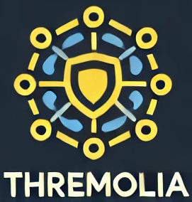
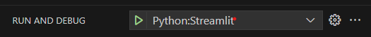

# OpenThremolia - LLM-powered threat modeling tool
<p align="center">
  
</p>

# Table of Contents
* [About](#about)
* [Architecture](#architecture)
* [Installation](#installation)
    * [Setup .env file](#setup-env-file)
* [Usage](#usage)
* [Documentation](#documentation)
* [For developers](#for-developers)
* [Docker usage](#thremolia-project-docker-usage)
    * [Streamlit GUI](#streamlit-gui)
    * [MCP Server](#mcp-server)
* [Acknowledgement](#acknowledgement)
* [Contact](#contact)
* [License](#license)

## About

The tool is designed to automate the process of threat modeling through LLM usage. All you need to do is provide your system description and LLM will do the rest.

- Supports OpenAI and Ollama models.
- Can convert DFD to a comprehensive text description.
- Analyzes the provided description using selected threat modeling frameworks and creates a threat report.
- Has automatic validation to ensure that the resulting report is of high quality.
- Supports custom LLM-based validators.
- Can provide detailed information about threats, mitigations, attack tactics, etc. using embeddings.
- Supports continuous work with generated reports using chat interface and tool calls.

## Architecture


## Installation

### Install required packages
```sh
pip install -r requirements.txt
```
### Setup .env file

Copy .env_example content to .env and fill it with your configuration and API keys.

For details about specific .env variables check the content of .env_example.


> [!TIP]
> If you want to use the app with a third-party LLM service, we support OpenAI API compatible endpoints (`/v1/chat/completions`). To configure the app, please research the configuration specifics of the desired endpoint. For example, some may require specific placeholder `api-keys` and non-default `base urls`.

## Usage

To start the application:
```sh
streamlit run streamlit_gui.py
```

You can directly chat with LLM about threat modeling frameworks or provide system description/DFD and let LLM analyze it to find possible threats.

After that LLM can answer your questions about the resulting report.

## Documentation

See [Basic App Principles](docs/basic_app_principles.md) for the current app workflow, recommendations and limitations.


# For developers

### Add debugging support to VScode

Open your .vscode\launch.json and add another configuration that uses streamlit module:

```json
{
    "name": "Python:Streamlit",
    "type": "debugpy",
    "request": "launch",
    "module": "streamlit",
    "args": [
        "run",
        "${file}",
        "--server.port",
        "8501"
    ]
}
```

Launch your app through debug window selecting the newly added configuration from the dropdown menu


# Docker usage

This project provides Docker images for two main components: the MCP server and the Streamlit GUI. Below are instructions for building and running each component.

## Streamlit GUI

The Streamlit GUI allows you to interact with the Thremolia application via a web interface.

### Build the Docker image:

```bash
docker build -f Dockerfile.streamlit -t thremolia-streamlit .
```

### Run the Docker container:

```bash
docker run -p 8501:8501 --env-file ./path/to/.env thremolia-streamlit
```
After running, you can access the GUI at: http://localhost:8501/

## MCP server

The MCP server provides backend functionality and can be used, for example, with GitHub Copilot.
### Build the Docker image:

```bash
docker build -f Dockerfile.mcp -t thremolia-mcp .
```
### Run the Docker container

When running the MCP server, you must provide an environment file (.env) and optionally mount a folder from the host:

```json
{
  "servers": {
    "Thremolia_mcp": {
      "command": "docker",
      "args": [
        "run",
        "--rm",
        "-i",
        "--env-file",
        "./path/to/.env",
        "-v",
        "/path/on/host:/path/in/container",
        "-v",
        "/path/on/host/logs:/logs",
        "thremolia-mcp"
      ]
    }
  }
}
```
    --env-file ./path/to/.env — pass required environment variables to the container.

    -v /path/on/host:/path/in/container — mount a host folder for input/output files.

    --rm — automatically remove the container after it stops.

    -i — keep STDIN open for interaction if needed.

> [IMPORTANT]
> Some MCP clients may have short request timeouts by default! This can lead to "Request timed out" errors due to lengthy report generation time. So please change the setting of your MCP client if you encounter such errors.

# Acknowledgement

We would like to acknowledge that this work was supported by the KKS foundation through the SERT Research Profile project (research profile grant 2018/010) at Blekinge Institute
of Technology and the Threat Modeling for LLM-Integrated applications (ThreMoLIA) research project supported by Vinnova (Sweden’s Innovation Agency) (Diarienummer 2024-00659).

Project participants:
* Blekinge Institute of Technology
* Ericsson AB

# Contact 
oleksandr.adamov@bth.se

# License
MIT (https://choosealicense.com/licenses/mit/)

