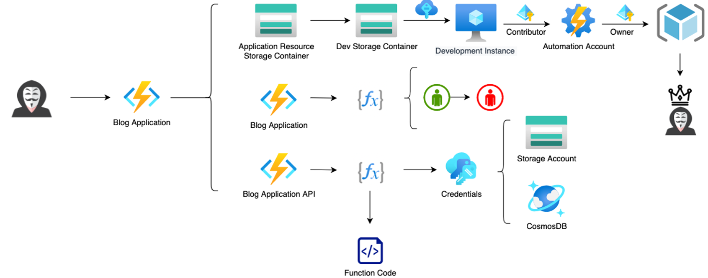

# AzureGoat example

This example uses the [AzureGoat](https://github.com/ine-labs/AzureGoat) architecture and terraform  deployment file for threat modeling.

## Details
During all threat modeling tasks we used only ChatGPT **o4-mini** model.

For threat modeling based on architecture we used the following image:

For threat modeling based on the deployment file we used [AzureGoat main.tf](./AzureGoat%20main.tf). It contains the structure of Azure project with resource configurations in the HashiCorp Terraform format.

Resulting files for architecture based threat modeling:

 1. [Thremolia save](./azure_goat_escalation_path.thremolia), [CSV](./azure_goat_escalation_path.csv)
 2. [Thremolia save](./azure_goat_escalation_path_GT.thremolia), [CSV](./azure_goat_escalation_path_gt.csv) with regular threats (ATT&CK and OWASP TOP 10) instead of LLM counterparts.

Resulting files for deployment file based threat modeling:

 1. [Thremolia save](./AzureGoat_deployment_file.thremolia), [CSV](./azure_goat_deployment_file.csv)
 2. [Thremolia save](./azure_goat_deployment_file_GT.thremolia), [CSV](./azure_goat_deployment_file_gt.csv) with regular threats (ATT&CK and OWASP TOP 10) instead of LLM counterparts.